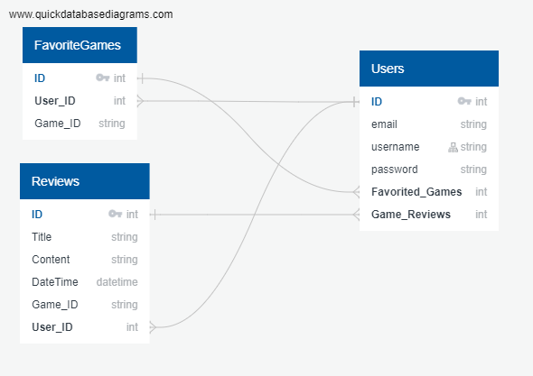

## Duncan's Toy Chest!

- **LIVE LINK:** https://duncans-toy-chest.herokuapp.com/
- **BOARD GAME ATLAS API DOCS:** https://www.boardgameatlas.com/api/docs

_This is my first capstone project for the Springboard Software Engineering Bootcamp. The program is a full CRUD app using the Board Game Atlas API._

_The app uses **Python** and **Flask** server-side, pulls and manipulates data from the BGA API, stores user information (including favorites board games and board game reviews) to a PostgreSQL database. The frontend is lightly styled with **Bootstrap** and a **styles.css** file in the **/static** folder. The app also uses **PostGreSQL**, and needs a database named `boardgames` to run correctly. More in depth information on the project, including database schemas and the project proposal, can be found in **/schemas**_

### Requirements and Dependencies:
This app uses PostgreSQL and connects to a database named `boardgames`. Be sure to create this database:
```sql
CREATE DATABASE boardgames;
```
Run the following commands in the terminal to run the app:
1. `python3 -m venv venv` to create a virtual environment
2. `source venv/bin/activate` to activate the virtual environment
3. `pip3 install -r requirements.txt` to install the current dependencies within the venv
4. `flask run` to start the flask server and run the program

Be sure to register an account to see the full app!

### Playing with the App:
>Be sure to register an account to see the full app!

DB Schema:


**Basic User Schema:**
- username (primary key)
- email
- password

**Basic Review Schema:**
- user_username (references the 'users' table)
- game_id (a string ID to make calls to the BGA API)
- title (title of the review)
- text (content of the review)
- timestamp (automatically saved timestamp of when the review is created)

**Basic Like Schema:**
- user_username (references the 'users' table)
- game_id (a string ID to make calls to the BGA API)

**Basic Functionality:**
1. Clicking 'Duncan's Toy Chest' in the navbar will redirect you to the home page
   1. either the login page, if not currently logged in, or
   2. the Top Rated Games page
2. Clicking 'Top Rated' in the navbar will pull up the top 24 games from the API
3. Searching by the dropdown 'Number of Players' returns the top 24 games with at least that many players
4. The search bar will return query results for games loosely matching the search term in 'name'
5. Login and Sign up will take you to the respective form pages, unless you are already logged in, in which case they'll bring you to the home page
6. Clicking on a game's category (any category listed) will pull up the top 24 games in that category
7. Clicking on a games player range (eg. '2-4 Players') will return the top 24 games within that range of players
8. Clicking on a game's name will bring up all the information for that game, including the game description, stats, top 6 youtube videos, and reviews in the PostgreSQL database. If user is logged in, it will also display a form to leave a review for that game.
9. Clicking on the heart button for a game will add that game to the user's favorites list (note: this button is only available to logged in users)
10. Clicking on 'My Profile' in the navbar, if logged in, will bring up the user's account profile, where user can see their list of favorited games, links to reviews they have posted, and optional buttons for edited and deleting their account.
11. Users can view each others profiles, but are not authorized to edit or delete any other user's information, including liked games.
12. User can edit their own reviews on a game either by viewing the review on the game's page, or by viewing the review from their own profile.


### Tests:
_This app is tested using **unittest**, **SeleniumBase**, and **pytest**. Each model and view function from **models.py** and **app.py** is tested, as well as the routes rendering html templates._

- #### Unit tests and API tests
**/tests and the files within it** connect to a database named `boardgames_test`. Be sure to create this database before running the tests file.

Chromedriver location: /home/jess/projects/capstone-1/venv/lib/python3.8/site-packages/seleniumbase/drivers/chromedriver

--> include steps for downloading SeleniumBase and specific chromedriver
--> Download test commands and results as text file to include in repo

Chrome location: /bin/google-chrome

- #### UI Tests
The **/ui_tests** directory holds the UI tests for the live link. Test reports documented in **dashboard.html**. 

To view the dashboard test reports, in your local repo in VSCode, right-click on **dashboard.html** inside of the ui_tests folder, and select 'Open With Live Server'.

**To run UI tests locally:**

The UI tests run by default on Chrome. If you want to run the test locally, be sure to have the latest version of Chrome installed. Then, download or clone the repo as per the instructions above and activate the local venv. Run the following commands in the terminal while inside the app directory to install and setup SeleniumBase:

1. `pip3 install seleniumbase` to install SeleniumBase for Python
2. `sbase get chromedriver` to install chromedriver
   
**Be sure to install the version of Chromedriver that matches your installed Chrome browser!!** To check which version of Chrome you have installed, type `chrome --version` in your terminal.

You can check the SeleniumBase and WebDriver docs if you need help troubleshooting installation:
- SeleniumBase install docs: https://seleniumbase.io/help_docs/install/
- WebDriver install docs: https://seleniumbase.io/help_docs/webdriver_installation/

Once you have SeleniumBase and Chromedriver installed, in the terminal, type the following commands:
1. `cd ui_tests`
2. `pytest` >> This command will run all UI tests in order
   - **Note: tests run headless by default; to view the tests in browser, run with `--headed`**

3. `pytest NAME_OF_TEST_FILE.py` >> You can select which individual test file to run by entering the name of the test
   - **test_home.py** >> Runs tests for user registration, login, logout, and deleting account
   - **test_likes.py** >> Runs tests for authenticated user liking, unliking games from home page, profile page, and game details page 
   - **test_reviews.py** >> Runs tests for authenticated user posting, editing, and deleting reviews for games
   - **test-game_pagination.py** >> Runs tests for searching games, and paginated search results for games
